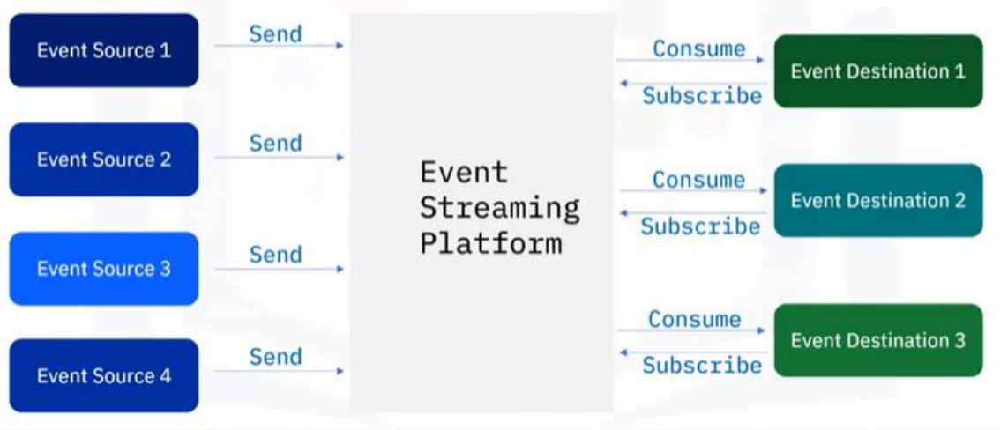
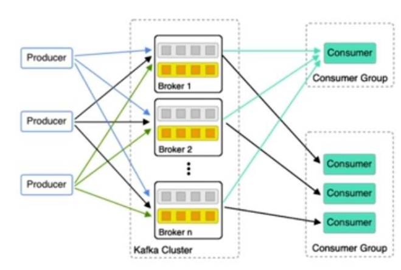

## Inhalt
* [Data Lake vs. Data Warehouse](#data-lake-vs-data-warehouse)
* [Cronjob vs. Airflow](#cron-vs-airflow)
* [Kafka](#kafka)
* [Redis](#redis)
* [MongoDB](#mongodb)
* [Key-Value vs. Dokumentenbasiert](#key-value-vs-dokumentenbasiert)

## Data Lake vs. Data Warehouse
| Data Lake  | Data Warehouse |
| ---------- | -------------- |
| rohe Datenstruktur  | Daten sind verarbeitet  |
| Zweck/Schema der Daten noch nicht festgelegt  | Zweck/Schema der Daten in Formate, Strukturen überführt  |
| Gut zugänglich und schnell zu aktualisieren | Teuer und Kompliziert änderungen vorzunehmen |
| Anwender: Data Scientists | Anwender: Business Analysten |

Was ist ein Data Lake?
* Nimmt sämtliche Daten in Ursprungsformat auf (Rohformat, z.B. Audio, Video, etc.)
* Noch keine Verwendung festgelegt (Kommt drauf an aber in erster Instanz dem "Raw Layer" ja)
* Daten werden irgendwann in der Zukunft gebraucht
* Strukturierung oder Umformatierung erfolgt erst wenn die Daten benötigt werden, daher sehr schnell

Was ist ein Data Warehouse (DWH)?
* Repository für Strukturierte, gefilterte Daten 
* Sind bereits für bestimmten Zweck verarbeitet
* Struktur und Schema der Daten bereits definiert
* Für Analyse der Daten aus Transaktionssystemen optimiert

## Cron vs. Airflow
Cronjobs
* Können eine Aktion (Script, Command, etc.) zu einem bestimmten Zeitpunkt ausführen

Airflow
* Können eine Aktion zu einem bestimmten Zeitpunkt ausführen
* Ist NICHT das Processing Tool, sondern nur der Koordinator
* Batch-orientierter Pipeline Builder
* Bietet eine UI
* Bietet DAGs (Directed Acyclic Graphs)
  * Von einander unabhängige Aktionen können
ausgeführt werden, und dennoch später
„zusammen“ genutzt werden
  * Statt eines riesen Scripts, haben wir schön kleine,
separat zu testende Units.
* Typische Stati (https://towardsdatascience.com/airflow-state-101-2be3846d4634)
  * No Status
  * Scheduled
  * Queued
  * Running
  * Success

Airflow Task vs. Operator (https://airflow.apache.org/docs/apache-airflow/stable/_api/airflow/operators/index.html)
* Im Operator beschreiben WIR was gemacht werden soll
* Im Task wird sichergestellt, das der Operator korrekt ausgeführt wird
(Argumente übergeben, Ergebnisse abholen, Reihenfolge, usw)
* Ein Task ist wie ein Wrapper um einen Operator
* Wichtige Operator sind PythonOperator, BashOperator & DateTimeOperator

## Kafka
* Anstelle von statischem "State" endlose Streams von "Events"
  * Zeitung: Statisch
  * Newsfeed: real-time
* Der wirkliche Unterschied: „Events“ sind ALLE Dinge, die passieren,
State ist die „Zusammenfassung“ der Events.
* Der Grund: fast immer ist „real-time“ data besser (???) als „slow“ data
 
 Beispiele
  * Fraud Detection
  * Paket Tracking
  * Real-time Inventory
  * Real-time recommendations

**ESP: Event Streaming Platform**
* Events
  * Irgendetwas "wichtiges" passiert
  * "an entity‘s observable state over time"
* Beispiele s.o.

**Mehr Beispiele Was Events sind und Wer Events braucht**
* Autos
* IoT, Edge Devices
* Datencenter
* SaaS Apps
* Multiplayer Games
* Warenbestände
* Microservices
* Data Lakes, Datenbanken

**Typische Formate der Daten sind**
* primitive Daten (int, string, etc.)
* Key-Value-Paar:
  * Key: "car_id_xyz"
  * Value: (44.87, -78.43)
  * (optional: mit timestamp: 17.03.2022 14h17:22)

**Event Streaming**
* 1 Sender, 1 Empfänger
  * Sender: all die schönen Datenquellen, die beim E von ETL anstehen (Extract Load Transform)
  * Empfänger: all die schönen "L"-Destinations UND aber auch:
    * Applications
    * Als Sender für weitere Empfänger
  * Bisher eigentlich eine ETL-Pipeline
* Aber was passiert wenn
  * wir n Sender und m Empfänger haben? UND
  * Empfänger auch Sender sein sollen? UND
  * Verschiedene Protokolle genutzt werden (FTP, HTTP, JDBC, SCP, etc.)
**Antwort: Publish-Subscribe**

**Ziel**
* Alle "Events" für alle (Interessierten) zur Verfügung stellen
* Real-Time (nicht Batch wie in Airflow) aber auch "verlangsamen" (handle back-pressure) wenn nötig
* Und wenn nötig, alle Events (für potentiell immer) aufbewahren, so dass man neue "Zusammenfassungen" machen kann.
* Apache Kafka: verteilter real-time Log, der (bei Bedarf) die Events speichert
* Wie soweit immer der Fall: fault-tolerant, verteilt, APIs für andere Sprachen, Devices usw.
* 35% der Fortune 500 / 80% der Fortune 100 nutzen Kafka
Kafka-Client-Server-Architektur
* Verteilte Server, auch "Broker" genannt
* Alle Broker werden (wurden :) ) von Apche Zookeeper verwaltet
* Clients
  * CLI
  * High-Lvel APIs (Java, Scala, Python, etc.)
* Wunderbar Skalierbar
* Replication: Sicherheit
* Persistency: Kann jederzeit auf alle Daten zugreifen (ist also NICHT Streaming im klassichen Sinn)

**Event Streaming Platform** (ESP)

**Aufgaben:**
* To publish (write) and subscribe to (read) streams of events, including continous import/export of your data from other systems.
* To store streams of events durably and relaibly for as long as you want
* To process streams of events as they occur or retrospectively

**Komponenten:**
* Broker: einzelner „Rechner“ mit eigenem Storage (wo Daten
„beliebig“ lang aufgehoben werden können). Viele Broker
zusammen: Kafka Cluster
* Event Broker
  * Ingester
  * Processor (De/Serializer, De/Compress, De/Crypt, etc.)
  * Consumption (Distribution, genau so beschauerter Begriff wie das L in ETL)
* Event Storage
* Analytic and Query Engine

## Redis 
[Redis EBook](https://redis.com/ebook/part-1-getting-started/)

[Redis Commands](https://redis.io/commands/)

Redis ist eine Key-Value-Datenbank

Häufiger Anwendungsfall von Redis ist Caching von Informationen zum schnelleren laden

**ACHTUNG ChatGPT Antwort**

Eine Key-Value Datenbank ist eine Art von Datenbank, die Daten als Schlüssel-Wert-Paare speichert. Ein Schlüssel ist ein eindeutiger Bezeichner, der einem bestimmten Wert zugeordnet ist. Der Wert kann ein beliebiger Datentyp sein, wie zum Beispiel eine Zeichenfolge, eine Zahl oder ein Binärobjekt.

Der Nutzen einer Key-Value Datenbank besteht darin, dass sie sehr schnell ist und eine einfache Art und Weise bietet, Daten zu speichern und abzurufen. Sie sind auch sehr skalierbar und können problemlos große Mengen an Daten verarbeiten.

Key-Value Datenbanken sind in vielen Anwendungen nützlich, in denen schnelle Lese- und Schreibzugriffe auf einzelne Datenwerte erforderlich sind. Sie werden oft in Anwendungen verwendet, die eine hohe Verfügbarkeit benötigen, wie zum Beispiel in der E-Commerce-Branche, bei der es wichtig ist, dass die Daten jederzeit abrufbar sind. Key-Value Datenbanken eignen sich auch gut für den Einsatz in verteilten Systemen, da sie leicht repliziert werden können, um die Verfügbarkeit und die Leistung zu verbessern.

1. Mit welchem Kommando wird in Redis eine Datenbank erzeugt (analog zu "CREATE" in SQL)

**A: SET?**

2. Wie viele verschiedene Datentypen kann Redis abspeichern?

**A: Strings, Lists, Sets, Hashes (Die wichtigsten) sonst noch Streams, Geospatial, HyperLogLog, Bitmaps, Bitfields**

3. Redis ist eine in-________ Datenbank, und daher besonders schnell.

**A: in-memory Datenbank, schnell aber teuer**

## MongoDB
MongoDB ist eine Dokumentenbasierte NoSQL-Datenbank (Not only SQL)

Updating Performance von MongoDB bei großen Datensätzen "nicht so gut"

Authentifizierungs Aufgabe
1. Auf welchen Ebenen gibt es Authentication?

**A: Docker und Datenbank**

2. Wie unterscheiden sich die beiden oben behandelten Ansätze?

**A: Bei dem einen wird der Zugriff auf den Docker mit einer Authentifizierung geschützt aber nicht die DB im Hintergrund bei dem anderen wird der direkte Zugriff auf die DB per Authentifizierung geschützt**

3. Wo/wann ist dies relevant?

**A: Produktiven Datenbanken, damit die Daten nicht verfälscht oder gestohlen werden**

4. Welche Art von Authentication ist in der Praxis wohl wichtiger?

**A: Die direkte Absicherung der Datenbank und nicht der Umgebung der DB**

## Key-Value vs. Dokumentenbasiert
| Key-Value | Dokumentenbasiert |
| --------- | ----------------- |
| Key-Value Datenbanken eignen sich am besten für Daten, die als einzelne Werte oder kleine Mengen strukturierter Daten organisiert sind. | Dokumentenbasierte Datenbanken eignen sich besser für größere Mengen strukturierter oder unstrukturierter Daten, die in Form von Dokumenten gespeichert werden.|
| Key-Value Datenbanken bieten in der Regel eine einfache Möglichkeit, Daten anhand ihres Schlüssels abzurufen, aber keine komplexen Abfragefunktionen. | Dokumentenbasierte Datenbanken bieten in der Regel umfangreichere Abfragefunktionen und ermöglichen es, nach bestimmten Feldern innerhalb von Dokumenten zu suchen. |
|Key-Value Datenbanken sind in der Regel sehr skalierbar und eignen sich daher gut für Anwendungen mit hohem Datenvolumen und hoher Last.|Dokumentenbasierte Datenbanken können ebenfalls skalierbar sein, aber ihre Skalierbarkeit hängt oft von der Art der Daten und der Abfragen ab, die sie unterstützen müssen.|
|Key-Value Datenbanken sollten genutzt werden, wenn schnelle Lese- und Schreibzugriffe auf einzelne Datenwerte benötigt werden und wenn die Daten, die gespeichert werden, in der Regel als einzelne Werte oder kleine Mengen strukturierter Daten organisiert sind.|Dokumentenbasierte Datenbanken sollten genutzt werden, wenn größere Mengen strukturierter oder unstrukturierter Daten gespeichert werden müssen und wenn komplexere Abfragen ausgeführt werden müssen.|
